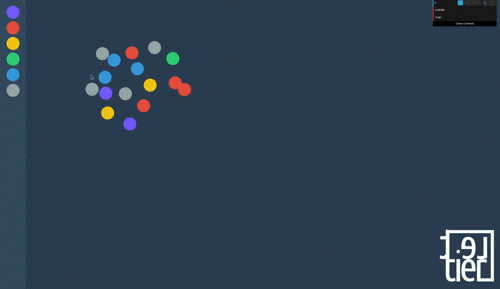

# Interactive K-Nearest Neighbors

Visually interact with dots in your browser classifying unknown dots using the K-Nearest Neighbors algorithm.  
Playable at [Lettier.com](http://www.lettier.com/knearestneighbors/).

## Get Started

```bash
git clone git@github.com:lettier/interactiveknn.git
cd interactiveknn
# Install nvm and npm.
nvm use
npm install
```

(C) 2016 David Lettier  
http://www.lettier.com/
